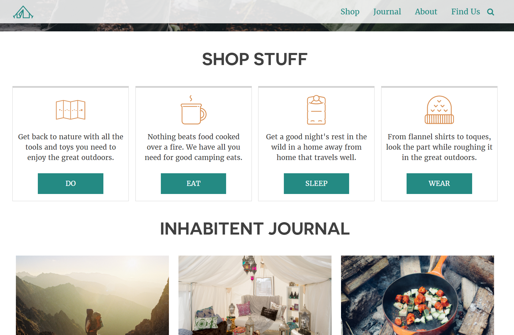

# Inhabitent

    

---

# Summary / Purpose

The Inhabitent project is my first attempt/run through of making a custom Wordpress theme. 

## Notable learnings include:
* The Wordpress template hierarchy
* Creating custom pages and taxonomies
* Creating and using field groups
* Styling a multipage project

---

# Technologies Used
* Wordpress
* PHP
* HTML and SCSS
* jQuery